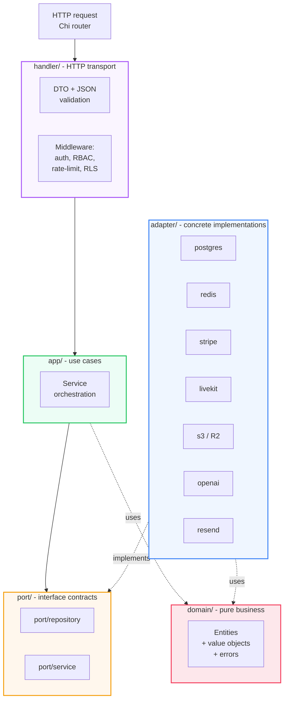
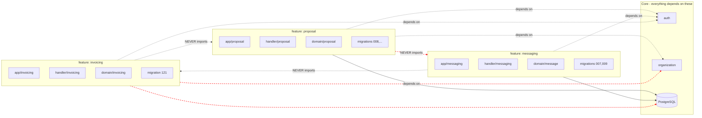
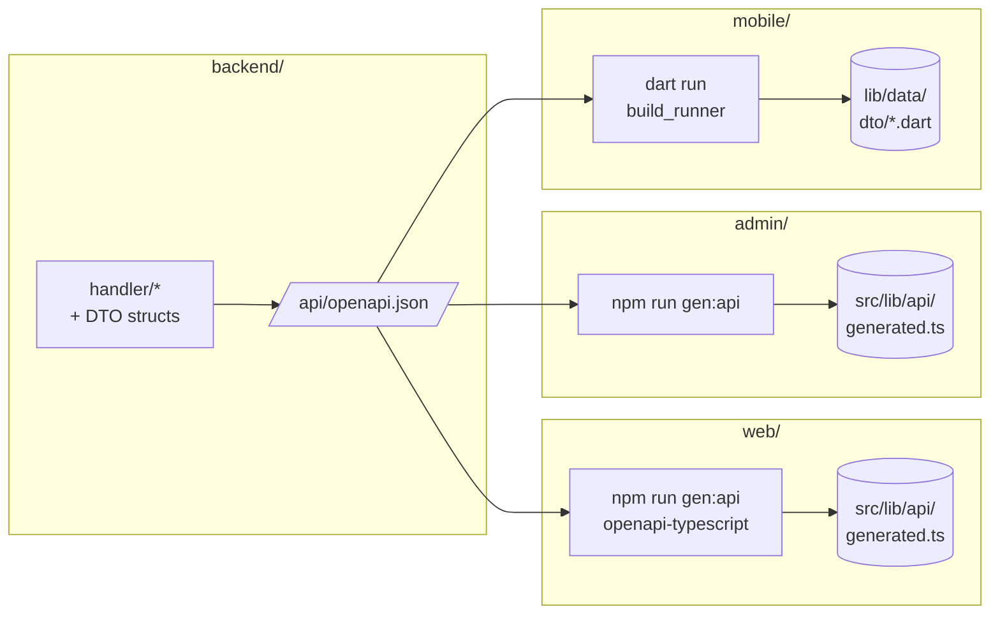
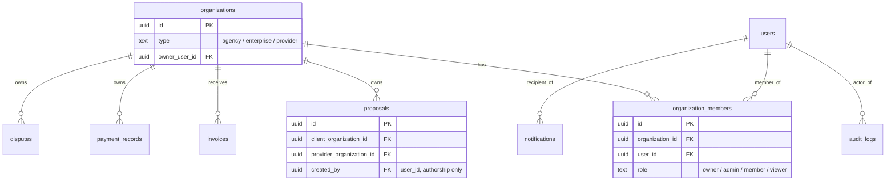
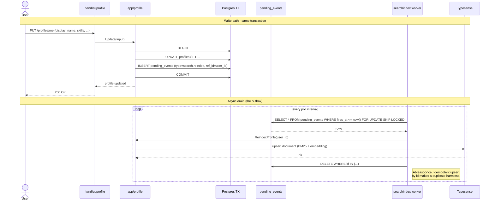
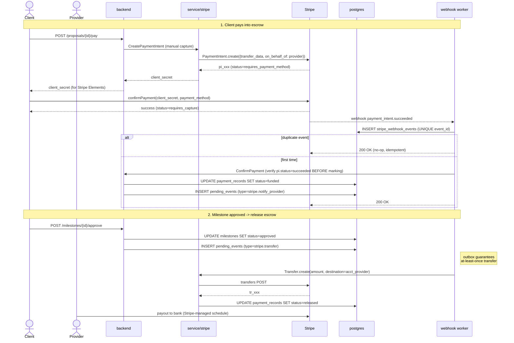
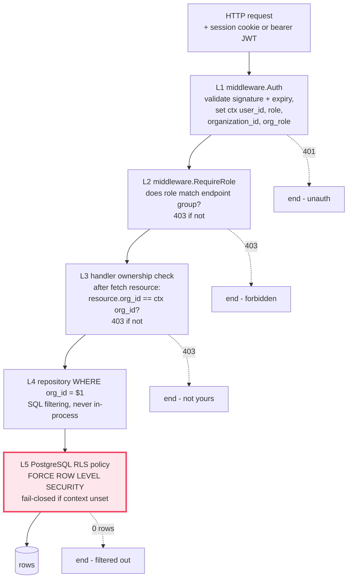

# Architecture

This document is the deep dive for engineers and reviewers. It explains
the "why" behind the structural decisions in the codebase and shows,
diagram by diagram, how the pieces fit together. If you only have time
for one document, read this one.

For per-app conventions (file layout, naming, idiomatic patterns) read
the matching `CLAUDE.md`:

- [`backend/CLAUDE.md`](../backend/CLAUDE.md)
- [`web/CLAUDE.md`](../web/CLAUDE.md)
- [`admin/CLAUDE.md`](../admin/CLAUDE.md)
- [`mobile/CLAUDE.md`](../mobile/CLAUDE.md)

---

## 1. Overview

**Mission.** A B2B marketplace that connects three primary roles —
**Agency** (`prestataire`), **Enterprise** (`client`), and **Provider**
(`freelance`) — with a fourth toggle on Provider that turns them into a
business referrer (`apporteur d'affaires`). Unlike a directory or a job
board, the marketplace handles the full lifecycle: discovery, proposal,
contract, escrow payment, milestones, dispute, invoice, payout, and
review.

**Four apps, one contract.**

| App | Stack | Source | Audience |
|-----|-------|--------|----------|
| `backend/` | Go 1.25 + Chi v5 + PostgreSQL 16 + Redis 7 + Typesense 28 | `backend/cmd/api/main.go` | API server, the single source of truth |
| `web/` | Next.js 16 + React 19 + Tailwind 4 | `web/src/` | End users (agencies, enterprises, providers, referrers) |
| `admin/` | Vite 7 + React 19 + Tailwind 4 | `admin/src/` | Platform staff (moderation, support, billing) |
| `mobile/` | Flutter 3.16+ / Dart 3.2+ | `mobile/lib/` | End users on iOS / Android |

**Numbers** (April 2026 snapshot, after six audit phases):

- **939+ commits** on `main`.
- **2,634** Go test functions across `backend/internal/**/_test.go`,
  **333** test files.
- **1,292** vitest cases across `web/src/**/*.test.ts(x)` (132 files).
- **341** Playwright e2e cases in `web/e2e/`.
- **806** Flutter test cases across `mobile/test/**` (105 files).
- **30** vitest cases for `admin/`.
- **125** SQL migrations applied. 9 tables protected by Row-Level
  Security with `FORCE ROW LEVEL SECURITY` so even the table owner
  cannot bypass.
- **gosec** baseline went from 35+ findings to **3 documented false
  positives**, all annotated inline.

The full test strategy lives in [`docs/testing.md`](testing.md).

---

## 2. Hexagonal architecture (backend)

The backend is built as a hexagon (a.k.a. ports and adapters). The
goal is one-way dependencies that flow from transport towards the
domain — never the other way around.



**The dependency rule** (absolute, never broken):

```
handler -> app -> domain <- port <- adapter
```

- `domain/` imports nothing except the Go standard library. Entities
  validate themselves; business invariants live here.
- `port/` imports only `domain/`. Every external collaborator is
  defined here as an interface.
- `app/` imports `domain/` and `port/` (interfaces), never an adapter.
- `adapter/` imports `domain/`, `port/`, and external libraries
  (`pgx`, `redis`, `stripe-go`, `livekit-server-sdk`, etc.). One
  adapter never imports another.
- `handler/` imports `app/` and `dto/`. Returns JSON.

Wiring — the only place adapters meet app services — is
`backend/cmd/api/main.go`. Switching from Stripe to PayPal is one
line there. Adding a new adapter is one new file in
`internal/adapter/<provider>/` plus its registration in `main.go`.

**Where to look in the code**:

- `backend/internal/domain/{user,proposal,payment,...}/` — 30
  domain modules.
- `backend/internal/port/{repository,service}/` — interface
  contracts only.
- `backend/internal/app/{auth,proposal,referral,...}/` — 34
  use case packages.
- `backend/internal/adapter/{postgres,redis,stripe,livekit,s3,
  openai,resend,...}/` — 21 concrete implementations.
- `backend/cmd/api/main.go` — the assembly room.

---

## 3. Feature isolation invariant

This is the rule that turns the codebase from a monolith into a
collection of independently shippable slices.



**A feature is removable when**:

1. Deleting its folder (backend `internal/app/<x>/`,
   `internal/handler/<x>_handler.go`, web `src/features/<x>/`,
   mobile `lib/features/<x>/`, admin `src/features/<x>/`) causes
   ZERO compile errors elsewhere.
2. No other feature imports from it. Cross-feature data is exchanged
   via injected interfaces wired in `cmd/api/main.go` only.
3. Its database tables can be dropped without breaking other tables
   (no cross-feature foreign keys; `users` and `organizations` are
   the only allowed targets).
4. The app still runs perfectly without it.

**Practical example.** If `ProposalService` needs to look up a user's
display name, it does not import `internal/app/user/`. It accepts a
`UserRepository` interface in its constructor. The wiring in
`main.go` injects the postgres-backed implementation. If the
profile feature is broken at compile time, the proposal feature
still compiles and starts.

**Where to look in the code**:

- 34 app packages in `backend/internal/app/` — no cross-imports
  between them, enforced by review.
- `web/src/features/` — 22 feature folders, all sibling-imports
  forbidden by ESLint.
- `mobile/lib/features/` — 32 feature folders following Clean
  Architecture (`data/`, `domain/`, `presentation/`).
- `admin/src/features/` — 10 admin feature folders.
- The contract test `web/e2e/refactor-isolation.spec.ts` exercises
  the invariant at runtime.

---

## 4. Contract-first API

The backend is the single source of truth for the API contract.
Every frontend generates its own types from the backend's OpenAPI 3.1
schema — there are **no shared packages** between the four apps.



**Why no shared packages.** The four apps evolve at different paces.
A schema change for the admin can ship without rebuilding the public
web. A mobile release can lag the backend by 12-48 hours during App
Store review without breaking either. Type generation per app means
each one only ships the slice of contract it actually uses.

**The contract gate.** Any breaking change to the OpenAPI schema is
caught by `scripts/ci/openapi-diff.sh`, run on every PR. Removing a
field or changing a type fails the build; adding fields, endpoints,
or optional parameters does not.

**Versioning**. URL-based: `/api/v1/`, `/api/v2/`. Old versions
support a 6-month deprecation window with a `Sunset` header before
removal.

**Where to look in the code**:

- `backend/internal/handler/` — 100 handler files generating the
  schema via reflection at boot.
- `backend/internal/handler/dto/` — request and response shapes.
- `web/src/lib/api/` — generated types + typed `fetch` wrappers.
- `admin/src/lib/api/` — same, scoped to admin endpoints.
- `mobile/lib/data/dto/` — Freezed DTOs generated via
  `json_serializable`.
- `scripts/ci/openapi-diff.sh` — the contract gate.

---

## 5. Org-scoped business state

All business state — subscriptions, wallet, billing, invoices, jobs,
contracts, KYC, commissions, referrals, team members — is owned by
an **organization**, not a user.

**Why.** A marketplace agency has multiple members who share a single
billing address, a single Stripe Connect account, a single wallet,
a single Premium subscription. If one member leaves, the agency
keeps its subscription and balance. The user is the actor; the
organization is the legal/economic entity.

**Two different IDs, two different jobs.**

| Column | Job |
|--------|-----|
| `organization_id` | Ownership. "Whose row is this?" Used in every `WHERE` clause for tenant scoping. |
| `user_id` (or `created_by`, `updated_by`) | Authorship. "Which member did this action?" Used in audit trails and notifications. |

**A table holding business state must use `organization_id`.** A
table using `user_id` for ownership is flagged as a bug (the
`subscriptions` table is the last known offender, scheduled for
migration on 2026-04-22 — see the `project_org_based_model.md`
memory).



**Where to look in the code**:

- `backend/internal/domain/organization/` — Organization entity and
  Role enum (Owner / Admin / Member / Viewer with 21 hardcoded
  permissions).
- `backend/internal/app/organization/service.go` —
  `CreateForOwner`, `ResolveContext`, `HasPermission`.
- `backend/internal/handler/middleware/auth.go` — extracts
  `organization_id` from the session or JWT claims and stores it in
  the request context.
- `backend/migrations/053_create_organizations.up.sql` and
  `054-057_*.up.sql` — the org foundation.

---

## 6. Authentication — dual-mode (web sessions + mobile JWT)

Web uses HTTP-only session cookies. Mobile uses bearer JWT tokens.
Both modes share the same auth service and the same Redis-backed
session record. The mobile-to-web bridge for embedded checkout
flows (see commit `04e354ca`) reuses this design.

```mermaid
sequenceDiagram
    actor U as User
    participant FE as Frontend (web or mobile)
    participant API as Backend / handler
    participant SVC as app/auth.Service
    participant RDS as redis (session + blacklist)
    participant DB as postgres (users + audit_logs)

    Note over U,DB: Login
    U->>FE: email + password
    FE->>API: POST /api/v1/auth/login
    API->>SVC: Login(email, password)
    SVC->>DB: GetByEmail
    DB-->>SVC: user (+ hashed password)
    SVC->>SVC: bcrypt compare
    alt bad password
        SVC->>RDS: INCR login_attempts:{email}
        SVC-->>API: ErrInvalidCredentials
        API->>DB: INSERT audit_logs (login_failure)
        API-->>FE: 401
    else 5+ failures in 15min
        SVC->>RDS: SET login_locked:{email} TTL 30min
        SVC-->>API: ErrLocked
        API-->>FE: 429 + Retry-After
    else success
        SVC->>RDS: CREATE session
        SVC->>DB: INSERT audit_logs (login_success)
        alt web
            SVC-->>API: session_id (cookie)
            API-->>FE: Set-Cookie: session=...; HttpOnly; SameSite=Lax; Secure
        else mobile
            SVC-->>API: access_jwt (15min) + refresh_jwt (7d)
            API-->>FE: { access_token, refresh_token }
        end
    end

    Note over U,DB: Refresh (mobile)
    FE->>API: POST /api/v1/auth/refresh (refresh_token)
    API->>SVC: Rotate(refresh_token)
    SVC->>RDS: jti blacklisted?
    alt blacklisted (token replay)
        SVC-->>API: ErrTokenReused
        API-->>FE: 401
    else fresh
        SVC->>RDS: ADD old_jti → blacklist (TTL = old TTL)
        SVC->>SVC: mint new pair
        SVC-->>API: new access + new refresh
        API-->>FE: { access_token, refresh_token }
    end
```

**Why dual-mode.** Browsers benefit from HTTP-only cookies (no
JS-readable token, immune to XSS exfiltration). Mobile clients need
explicit token management to handle background refresh, app-state
restoration, and multi-account switching. The dual-mode is hidden
behind `service.TokenService` and `service.SessionService`
interfaces — the auth service does not know which one it produced.

**Where to look in the code**:

- `backend/internal/app/auth/service.go` — `Login`, `Register`,
  `RefreshToken`, `Logout`.
- `backend/internal/app/auth/bruteforce.go` — Redis-backed counter +
  lockout.
- `backend/internal/adapter/redis/token_blacklist.go` — refresh
  token rotation backstore.
- `backend/internal/handler/middleware/auth.go` — accepts both
  cookie and bearer modes, populates the request context with
  `user_id`, `role`, `organization_id`, `org_role`.
- `mobile/lib/core/network/api_client.dart` — single-flight refresh
  pattern preventing thundering-herd 401s during background wake-up
  (BUG-08 fix).

---

## 7. Search engine — Typesense + outbox pattern

Search runs on Typesense 28 (Apache 2.0, Go-binary, BM25 + native
vector). The semantic half of the hybrid query is powered by OpenAI
`text-embedding-3-small`. The full architecture lives in
[`docs/search-engine.md`](search-engine.md); the slice below shows how
profile mutations make their way into the index without losing
events.



**Why an outbox.** The search index lives in a different process
(potentially a different machine, certainly a different DB).
Posting to Typesense from inside the request handler creates two
failure modes: dropped events when Typesense is briefly down, and
ghost events when the database transaction rolls back after the
external call. The outbox pattern removes both — `pending_events` is
written in the same transaction as the business mutation, so the
event exists if and only if the data exists. The worker drains in
the background.

**Profile mutation visibility**: typically <2s end-to-end. The
worker polls every 1s and processes batches of up to 200 rows.

**Where to look in the code**:

- `backend/migrations/<NNN>_*.up.sql` — the `pending_events` table
  definition (contains both search reindex events and Stripe outbox
  events; one shared, durable queue).
- `backend/internal/app/searchindex/publisher.go` — INSERT into
  `pending_events` as part of the business transaction.
- `backend/internal/adapter/worker/worker.go` — the drain loop,
  `SELECT FOR UPDATE SKIP LOCKED`.
- `backend/internal/search/` — Typesense schema, scoped key
  generator (cryptographically pinned per persona), hybrid query
  builder.
- `docs/search-engine.md` — the full architecture, ranking spec, and
  `docs/ranking-tuning.md`.

---

## 8. Payment flow — Stripe Connect + Embedded Components

Money in: client funds an escrow held by the platform. Money out:
on milestone approval (or dispute resolution), funds are transferred
to the provider's connected Stripe account. KYC, account creation,
and bank account onboarding all use Stripe Embedded Components
(decided 2026-04-04 — see the `project_stripe_embedded_decision.md`
memory).



**Critical invariants**:

- The `ConfirmPayment` handler verifies `stripe.PaymentIntents.Get(...).Status
  == "succeeded"` before marking the record as funded. This was a
  Phase 2 fix (BUG-01 / SEC-02) — never trust the client to tell us
  payment succeeded.
- Webhook events are deduped against the `stripe_webhook_events`
  table (UNIQUE on `event_id`). The Postgres row is the source of
  truth; Redis is a 60-second fast-path to avoid hitting the DB on
  the hot replay path.
- Transfers go through the same `pending_events` outbox as search
  reindexes — the payment release is durable across worker
  restarts, and a duplicate transfer attempt is harmless because
  Stripe's `idempotency_key` is the event id.

**Where to look in the code**:

- `backend/internal/adapter/stripe/` — payment, transfer, account,
  webhook handlers.
- `backend/internal/app/payment/service.go` — escrow state machine.
- `backend/internal/app/webhookidempotency/claimer.go` — `INSERT
  ... ON CONFLICT DO NOTHING` guarantees one and only one
  processing per event.
- `backend/internal/handler/embedded_handler.go` — Stripe Embedded
  Components session minting for KYC + payouts.
- `backend/internal/handler/wallet_handler.go` — wallet operations
  routed through the same service.

---

## 9. Multi-tenant security model

Three layers, evaluated in order. Every request must pass all three;
the database itself is the final backstop.



**RLS deep dive.**
[`backend/migrations/125_enable_row_level_security.up.sql`](../backend/migrations/125_enable_row_level_security.up.sql)
turns on RLS on **9 tenant-scoped tables** with `FORCE ROW LEVEL
SECURITY` so the table owner does not bypass the policy:

1. `conversations` (organization_id + participant fallback)
2. `messages` (joined via conversation)
3. `invoice` (recipient_organization_id)
4. `proposals` (client_organization_id OR provider_organization_id)
5. `proposal_milestones` (joined via proposals)
6. `notifications` (user_id, per-recipient)
7. `disputes` (client_organization_id OR provider_organization_id)
8. `audit_logs` (user_id, append-only since migration 124)
9. `payment_records` (organization_id)

The policy pattern is uniform: `USING (organization_id =
current_setting('app.current_org_id', true)::uuid)`. The `true`
argument makes `current_setting` return NULL when the GUC is not
set; an unset context yields NULL = NULL = NULL → row filtered out.
**This is a fail-closed default.** If the tenant context is missing,
the database denies access rather than granting it.

The GUC is set with `SET LOCAL` at the beginning of every business
transaction by `RunInTxWithTenant` —
[`backend/internal/adapter/postgres/tx_runner.go`](../backend/internal/adapter/postgres/tx_runner.go).
`SET LOCAL` is scoped to the transaction, so the setting cannot leak
across requests sharing the same connection from the pool.

The `users` table is intentionally **not** RLS-protected — the auth
flows (`/auth/login`, `/auth/register`, `/auth/forgot`) run before
the tenant context is established, so a policy keyed on
`current_org_id` would block them.

**Production deployment requires two distinct database roles**: the
application user (non-superuser, does not own tables) and the
migration user (owns tables, used only at deploy time). The setup is
documented in `backend/docs/rls.md`. Without role separation, the
application user's table ownership lets it bypass RLS — defeating
the whole point.

The `audit_logs` table goes one step further: `REVOKE UPDATE,
DELETE` (migration 124). The application user has only INSERT and
SELECT. Deleting an audit row requires a deliberate DDL escalation —
we want that paper trail.

**Where to look in the code**:

- `backend/internal/handler/middleware/auth.go` — L1 + L2.
- `backend/internal/adapter/postgres/tenant_context.go` — sets the
  `app.current_org_id` GUC.
- `backend/internal/adapter/postgres/rls_isolation_test.go` —
  cross-tenant denial integration test (proves a leak attempt
  returns 0 rows).
- `backend/internal/app/audit/service.go` — append-only writer.
- `backend/migrations/124_audit_logs_grants.up.sql` — REVOKE.
- `backend/migrations/125_enable_row_level_security.up.sql` — RLS
  policy definitions.

---

## 10. Observability

Every request gets a unique **request id** (UUID v4) at the edge,
propagated through `context.Context`, and embedded in every log
line, every database query, and every external API call. Bugs that
span four log lines, three services, and two queues are reconstructible
in five minutes via `grep request_id=...` across the unified log
stream.

**Structured logging with `slog`.** All logs are JSON. Every line
includes `time`, `level`, `msg`, `request_id`, plus contextual
fields (`user_id`, `organization_id`, `path`, `method`, `status`,
`duration_ms`).

```json
{
  "time": "2026-04-30T10:30:00Z",
  "level": "INFO",
  "msg": "request completed",
  "request_id": "550e8400-e29b-41d4-a716-446655440000",
  "method": "POST",
  "path": "/api/v1/proposals",
  "status": 201,
  "duration_ms": 42,
  "user_id": "9b3c…",
  "organization_id": "1f2a…"
}
```

**Health endpoints**:

| Endpoint | Purpose | Body |
|----------|---------|------|
| `GET /health` | Liveness — is the process alive? | `{"status":"ok"}` |
| `GET /ready` | Readiness — DB + Redis + Typesense reachable? | `200` if all three, `503` otherwise |

The readiness probe failing on Typesense is intentional: a
misconfigured search adapter causes 401s on every search request,
so the load balancer should rotate the instance out instead of
serving broken responses.

**Audit log** (covered in §9): every mutation, every login, every
permission denial, append-only.

**Slow-query log**: any DB call over 50ms is logged at WARN by the
`pkg/dbx` wrapper. Used by the on-call engineer for triage; queries
exceeding 200ms trigger an automatic `EXPLAIN ANALYZE` capture.

**Future**: OpenTelemetry traces and Prometheus metrics export are
on the roadmap (Phase 7+). The hooks are in place — `slog.Handler`
is wired so that switching to a tracing-aware backend is one line in
`main.go`.

**Where to look in the code**:

- `backend/internal/handler/middleware/request_id.go` — UUID
  generation + context propagation.
- `backend/internal/handler/middleware/logging.go` — request
  start/end, duration, status code.
- `backend/internal/handler/health_handler.go` — liveness +
  readiness.
- `backend/pkg/dbx/` — slow-query wrapper around `*sql.DB`.
- `backend/internal/app/audit/` — audit writer.

---

## 11. Pluggable adapters — proof of the open/closed principle

The shape of `internal/adapter/` is the single best argument for the
hexagonal style. Each subdirectory is one provider; switching it is
one line in `main.go`.

```
backend/internal/adapter/
├── anthropic/        — text moderation (alternate provider)
├── comprehend/       — AWS text moderation (legacy, swappable)
├── email/            — generic SMTP (default in dev)
├── fcm/              — Firebase Cloud Messaging push
├── livekit/          — video call signaling
├── nominatim/        — geocoding
├── noop/             — no-op adapters for tests
├── openai/           — embedding + moderation
├── pdf/              — invoice / credit-note rendering
├── postgres/         — relational store (45+ repos)
├── redis/            — sessions, cache, rate-limit, blacklist
├── rekognition/      — AWS image moderation
├── resend/           — transactional email (default in prod)
├── s3/               — object storage (MinIO local, R2 prod)
├── s3transit/        — short-lived presigned URL flow
├── sqs/              — message queue (alternate to in-memory worker)
├── stripe/           — payments + Connect + Embedded
├── vies/             — EU VAT validation
├── worker/           — outbox drain worker
└── ws/               — WebSocket fanout
```

Want to swap text moderation from OpenAI to Anthropic? Set
`TEXT_MODERATION_PROVIDER=anthropic` in `.env` (the env-driven
constructor is in `main.go`). Want to add a Brazil-specific PIX
payment provider? Create `internal/adapter/pix/payment.go`
implementing `port/service.PaymentService`, register it in `main.go`
under a feature flag, and you are done — the rest of the application
does not change.

---

## 12. Where to go next

- [`docs/testing.md`](testing.md) — every test layer, every cadence,
  every coverage commitment.
- [`docs/ops.md`](ops.md) — operational runbook (deploys, reindex,
  key rotation, incident response).
- [`docs/search-engine.md`](search-engine.md) — Typesense schema,
  ranking, scoped key firewall.
- [`docs/ranking-v1.md`](ranking-v1.md) and
  [`docs/ranking-tuning.md`](ranking-tuning.md) — search ranking
  spec and the tuning sandbox.
- [`docs/DEPLOYMENT.md`](DEPLOYMENT.md) — production deployment
  walkthrough (Railway, Vercel, Neon, R2, Resend, LiveKit, Stripe).
- [`SECURITY.md`](../SECURITY.md) — vulnerability reporting policy.
- [`CONTRIBUTING.md`](../CONTRIBUTING.md) — how to add a feature.

If you read all of the above, you understand the marketplace as
deeply as anyone else does. Welcome.
