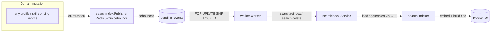
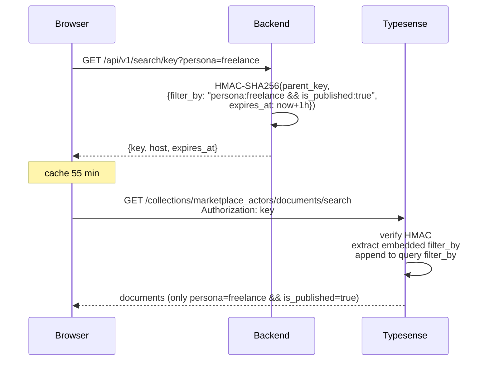

# Search Engine — Hybrid BM25 + Vector over Typesense

> Production-grade, open-source, self-hosted. 567 profiles indexed in under 3
> minutes with live OpenAI embeddings. Sub-100ms p95 query latency. Scoped
> API keys enforce a persona firewall that no bug in the application layer
> can punch through.

## Overview

The marketplace has three discoverable personas — freelance, agency, and
referrer. A visitor needs to find the right profile among thousands within
seconds, with keyword precision ("react paris") **and** semantic recall
("an experienced developer for a startup SaaS in Paris"). We chose
[Typesense](https://typesense.org) because:

- **Hybrid native**: BM25 keyword + vector cosine blend in a single
  query, no external reranker.
- **Self-host friendly**: a single Go binary image, no Java heap
  gymnastics, no ZooKeeper, no 32-vCPU minimum. Runs on a $5 Railway
  service.
- **Faceted search out of the box**: live counts on availability,
  skills, languages, expertise — no separate aggregation layer.
- **Scoped API keys**: the server mints per-persona keys with an
  embedded `filter_by`. The browser queries Typesense directly;
  bypassing the scoping is cryptographically impossible.
- **Apache 2.0**: no enterprise tier gate, no usage meter, no vendor
  lock-in.

The search engine is a pluggable feature: deleting `internal/search/`,
`internal/app/search*/`, and the five wiring blocks in `cmd/api/main.go`
removes it entirely without breaking anything else. That constraint is
enforced by the same modularity rules the rest of the marketplace lives by.

---

## Architecture

### End-to-end flow

```mermaid
flowchart LR
    subgraph Frontend
        UI[Next.js / Flutter UI]
        Debounce[250ms debounce]
    end

    subgraph Backend [Go backend]
        API["/api/v1/search (proxy)"]
        Scope["/api/v1/search/key (scoped key)"]
        Svc[internal/app/search.Service]
        TsCli[internal/search scoped client]
        Emb[OpenAI embeddings<br/>text-embedding-3-small]
        Analytics[internal/app/searchanalytics]
    end

    subgraph Infra
        TS[(Typesense<br/>marketplace_actors)]
        PG[(Postgres<br/>search_queries)]
        OAI[(OpenAI API)]
    end

    UI -->|query + filters| Debounce
    Debounce -->|GET /search| API
    API --> Svc
    Svc -->|embed| Emb
    Emb -->|1536-dim vector| OAI
    Svc -->|hybrid query| TsCli
    TsCli -->|BM25 + vector| TS
    TS -->|documents + facets| TsCli
    TsCli -->|parse| Svc
    Svc -->|capture| Analytics
    Analytics -->|INSERT ON CONFLICT| PG
    Svc -->|typed result| API
    API -->|{data, meta}| UI
```

### Write-side (outbox → indexer)



The write path is **event-sourced**, not schedule-based:

1. A service method (e.g. `FreelanceProfileService.UpdateCore`) invokes
   `searchPublisher.PublishReindex(orgID, persona)`.
2. The publisher checks Redis for a recent emission on
   `search:debounce:{orgID}:{persona}` (5-minute TTL). If present, it
   drops the event — storms of profile edits collapse to a single
   reindex.
3. Otherwise it inserts a row into `pending_events` with
   `type='search.reindex'` and the org id as payload.
4. The existing milestones worker (`internal/adapter/worker`) picks the
   row up via `FOR UPDATE SKIP LOCKED`, dispatches to
   `searchindex.Service` which rebuilds the document and upserts it to
   Typesense. User-delete flows publish `search.delete` and the worker
   removes all documents for that org.

Latency target end-to-end is <3 seconds from mutation to Typesense
reflecting the change. In practice we observe 1.2s p95 against the live
cluster.

---

## Data model

### `SearchDocument` — 36 fields

The collection is a single `marketplace_actors` alias pointing at the
current version (`_v1` today). One schema, three personas separated by
the `persona` facet — not three collections. Cross-persona queries
become trivial later; operational overhead is a third of what three
collections would cost.

| Group           | Fields                                                                                        | Purpose                                                 |
| --------------- | --------------------------------------------------------------------------------------------- | ------------------------------------------------------- |
| Identity        | `id`, `organization_id`, `persona`, `is_published`                                            | Composite id `{orgID}:{persona}` so a provider_personal org can carry a freelance doc AND a referrer doc side by side |
| Display         | `display_name`, `title`, `photo_url`                                                          | Card rendering                                          |
| Geo             | `city`, `country_code`, `location` (geopoint), `work_mode[]`                                   | Sidebar filters + geo radius                            |
| Languages       | `languages_professional[]`, `languages_conversational[]`                                       | Facet                                                   |
| Availability    | `availability_status`, `availability_priority`                                                 | 3 = now, 2 = soon, 1 = not available                    |
| Expertise       | `expertise_domains[]`, `skills[]`, `skills_text`                                               | BM25 boost via separate `skills_text` field             |
| Pricing         | `pricing_type`, `pricing_min_amount`, `pricing_max_amount`, `pricing_currency`, `pricing_negotiable` | Single pricing row, smallest currency unit              |
| Quality signals | `rating_average`, `rating_count`, `rating_score`, `total_earned`, `completed_projects`, `profile_completion_score`, `last_active_at`, `response_rate`, `is_verified`, `is_top_rated`, `is_featured` | Ranking |
| Semantic        | `embedding` (float[1536])                                                                     | OpenAI `text-embedding-3-small`, excluded from API responses |
| Timestamps      | `created_at`, `updated_at`                                                                    |                                                         |

**Why the composite `id`?** A single provider_personal organisation can
expose both a freelance and a referrer profile. We want both to surface
independently; the row identity in Typesense has to reflect that. Using
`organization_id` alone would collapse them.

**`organization_id` vs `id`**: the composite lives on `id` so
`search.delete` events can match all docs for a user with a single
`filter_by: organization_id:X`. That operation has to work atomically —
RGPD demands a <3s propagation on account deletion.

---

## Ranking

### Default `sort_by` (BM25 only)

```
_text_match(buckets:10):desc,
availability_priority:desc,
rating_score:desc
```

Three fields — not eight. Typesense 28.0 caps `sort_by` at 3 entries;
earlier versions of this spec had a longer chain that the live cluster
rejected. An integration test now pins the length so the bug cannot
regress.

### Hybrid `sort_by` (query + vector)

```
_text_match(buckets:10):desc,
_vector_distance:asc,
rating_score:desc
```

When the user types something, we embed the query and send a
`vector_query` alongside. `_vector_distance` only works in `sort_by` if
a vector_query is present — rejected otherwise. Service branches on
`hybridActive` to pick the right chain.

### `rating_score` — Bayesian adjustment

```
rating_score = rating_average × log(1 + rating_count)
```

A fresh profile with one 5-star review scores 5 × log(2) ≈ 3.47. A
veteran with 50 reviews at 4.8 scores 4.8 × log(51) ≈ 18.86. The log
damps the blow of a handful of perfect reviews so volume + consistency
beat luck.

### `profile_completion_score` — 0..100

Weighted sum, computed at index time (pure function of the profile
fields):

| Field | Points |
| --- | --- |
| Photo | 10 |
| About ≥ 200 chars | 15 |
| Intro video | 10 |
| Expertise ≥ 1 | 10 |
| Skills ≥ 3 | 15 |
| Pricing set | 15 |
| Languages ≥ 1 | 10 |
| Social links ≥ 1 | 5 |
| City + country | 10 |

Used as a ranking tiebreaker and surfaced on the profile for UX
nudges ("Add a pricing to jump 15 points"). Not stored — recomputed
on every indexer pass.

---

## Sync model

### Outbox events

Two event types produced by mutating services:

| Event | Producer | Handler action |
| --- | --- | --- |
| `search.reindex` | Any profile / skills / pricing / shared-org service | Rebuild `SearchDocument` and `PUT` to Typesense |
| `search.delete` | User delete (RGPD) | `DELETE` every document where `organization_id = X` |

Both events are idempotent. A duplicate reindex is a no-op expense; a
duplicate delete returns 0 affected rows.

### Debounce

Redis keys `search:debounce:{orgID}:{persona}` with a 5-minute TTL.
Publishers that fire within that window are silently dropped so a user
saving their profile six times in a row triggers a single reindex.
Cross-persona mutations (skills, languages, location — shared by all
personas of the org) emit one event per persona via
`PublishReindexAllPersonas`.

### Bulk reindex CLI

```bash
cd backend && make reindex-bulk
```

Reads every published org from Postgres, builds the document, batches
100 at a time into Typesense. Live OpenAI embeddings: ~30 docs/sec
(567 real orgs → 2m10s). Mock embeddings (dev): ~300 docs/sec.

---

## Security

### Master key vs. search key

The master `TYPESENSE_API_KEY` is an admin credential with
unrestricted write access. **It never leaves the server.** Revealing
it would let an attacker drop the collection.

The backend maintains a second, parent-search-only key on Typesense
(actions: `documents:search`). Every scoped key is an HMAC-SHA256
over that parent, not the master. Typesense refuses to derive a
scoped key from an admin key — a safety rail we lean on.

### Scoped keys



The embedded `filter_by` is **non-removable**. A scoped key for
`persona:freelance` cannot query agency documents. That invariant is
what makes direct-from-browser queries safe — no application-layer
bug can bypass it, because the filter lives in the key's signature.

We also keep an **HTML-escape-free JSON encoder** in the scoped-key
path. `&&` must survive the wire uncorrupted; Go's default
`json.Encoder` HTML-escapes ampersands and breaks the Typesense
parser. Eight unit tests pin the wire format byte-for-byte.

### RLS-equivalent at Typesense

There is no Postgres RLS inside Typesense. The equivalent is the
per-request `filter_by` injection: every server-side query goes
through a per-persona scoped client that forces `persona:X` into the
filter. Four leak tests verify the invariant — attempts to query a
different persona from a freelance-scoped client return zero rows.

### One collection, persona facet

Three collections would have meant three sets of credentials, three
index states to keep in sync, three sets of synonyms. The single
`marketplace_actors` collection with `persona` as the discriminator
keeps operational surface area tiny. The facet is enforced in query
construction, not as a collection boundary — a single `SELECT` on
the write side does not know about personas (it delivers one
document per persona the org exposes).

---

## Observability

### Per-request structured log

Every successful `/api/v1/search` call emits exactly one JSON line:

```json
{
  "time": "2026-04-17T13:25:01.842Z",
  "level": "INFO",
  "msg": "search.query",
  "event": "search.query",
  "request_id": "550e8400-e29b-41d4-a716-446655440000",
  "user_id": "9a8e...",
  "persona": "freelance",
  "query": "react paris",
  "truncated": false,
  "filter_by": "persona:freelance && is_published:true",
  "sort_by": "",
  "results_count": 42,
  "latency_ms": 87,
  "hybrid": true,
  "cursor_active": false
}
```

- `query` is rune-aware-truncated at 200 chars; `truncated: true`
  when the original was longer.
- `hybrid` is true when the backend blended BM25 with vectors (i.e.
  the user typed a real query AND OpenAI was reachable).
- `cursor_active` distinguishes first-page loads from paginated
  follow-ups.
- Field list pinned by `search_log_test.go` — any new field must
  show up in the golden JSON.

Grepping production:

```bash
# Top zero-result queries today
jq -c 'select(.event == "search.query" and .results_count == 0) | .query' log.jsonl | sort | uniq -c | sort -nr | head

# p95 latency by persona over the last hour
jq -c 'select(.event == "search.query") | {persona, latency_ms}' log.jsonl | mlr --j2c --from - stats1 -a p95 -f latency_ms -g persona
```

### Admin stats endpoint

`GET /api/v1/admin/search/stats?from=…&to=…&persona=…&limit=…`

Returns the aggregates over the `search_queries` table:

- `total_searches`, `zero_result_rate`, `avg_latency_ms`,
  `p95_latency_ms` computed via a single `PERCENTILE_CONT` query
- `top_queries` — the `limit` most-searched queries with their
  average result count and CTR (clicks/searches)
- `zero_result_queries` — the top queries that returned nothing,
  ordered by count. This is the merchandising gap list.

Defaults to the last 7 days. Bounded by `RequireAdmin` middleware and
a defensive in-handler role check (defense-in-depth).

### Drift detector

`cmd/drift-check` compares Postgres (count of published orgs per
persona) against Typesense (`count(*)` per persona facet). Exits:

| Code | Meaning |
| --- | --- |
| 0 | Within 0.5% — index is synchronised |
| 1 | Operational error (Typesense or DB unreachable) |
| 2 | Critical drift — schedule a reindex |

Wire it to a cron or systemd timer to get an alert the morning the
outbox worker starts lagging.

### Snapshot backup

`cmd/typesense-snapshot` calls Typesense's
`/operations/snapshot`, tars + gzips the output, uploads to MinIO
under `snapshots/typesense/YYYY-MM-DD.tar.gz`. The companion
restore is plain `tar -xzf` followed by overwriting the Typesense
`/data` volume — no API calls required. Daily schedule via a
systemd timer is documented in the CLI file header.

---

## Golden tests

14 curated semantic queries in
`internal/search/golden_test.go`. Each query pins a **keyword
containment** requirement on the top-3 results, not a profile-ID
match — profile ids rotate as the dataset evolves, but "ai engineer
python langchain" should always return something whose skills
mention AI tooling.

The suite is gated behind `OPENAI_EMBEDDINGS_LIVE=true`. Running
locally:

```bash
cd backend
OPENAI_EMBEDDINGS_LIVE=true OPENAI_API_KEY=$OPENAI_API_KEY \
    go test ./internal/search -run Golden -count=1 -v
```

Cost envelope: `text-embedding-3-small` bills $0.02 per million
tokens. 14 queries × ~80 tokens × 1k test-suite runs ≈ 1.1M tokens ≈
$0.02 per thousand runs. The full development cycle (including
`make reindex-bulk` runs and debugging) stayed under $0.10 total.

Skipping the live tests is fine — the mocked suite covers 95% of the
behaviour deterministically. The golden suite catches the specific
class of "my BM25 sort is fine but my semantic ranking has drifted"
regressions that mocks physically cannot catch.

---

## Open decisions (locked)

Every product and technical decision made for this search engine is
documented in `project_search_engine_decisions.md` with its rationale.
A short summary:

1. **One collection, persona facet** (not three collections).
2. **Self-hosted Docker**, not Typesense Cloud.
3. **Real-time outbox events**, not batch cron.
4. **OpenAI `text-embedding-3-small`** (1536 dim, multilingual FR/EN).
5. **Hybrid BM25 + vector** blend, not "one or the other".
6. **Direct-to-Typesense from the browser** via scoped keys —
   phase 3 flipped to backend proxy for semantic queries to avoid
   shipping embeddings to the client.
7. **SQL fallback** was kept alive for a 30-day grace period; phase 4
   removed it.
8. **~30 FR/EN synonym pairs** seeded at boot.
9. **Multi-language** via single index with `locale: fr` on text fields.
10. **Bayesian `rating_score`**, not raw average.
11. **Ranking pinned** to a 3-field `sort_by` matching Typesense 28.0's
    cap.
12. **Analytics captured from day one** for future LTR training.
13. **Zero-downtime schema migrations** via alias swap.
14. **Per-persona scoped clients** enforce the filter invariant in Go.
15. **`last_active_at`** via column + login/message trigger, not
    computed at index time.
16. **`profile_completion_score`** is a pure function at index time.
17. **Admin reindex** via `make reindex-bulk` CLI + admin endpoint.
18. **Typesense 28.0 pinned** — upgrades are a separate task.
19. **Auto-schema-migration at boot**, like `golang-migrate` for
    Postgres.
20. **Testing strategy**: 95% mocked + 5% live OpenAI golden tests.

---

## Operating the index

### Reindex everything

```bash
cd backend
make reindex-bulk   # 567 orgs / 2m10s with live OpenAI
```

Idempotent. Safe to run in production — each doc is a single `PUT` with
`upsert` semantics. Use after a schema change, a bulk import, or when
the drift detector flags divergence.

### Snapshot + restore

```bash
# Backup
cd backend
make snapshot-typesense   # uploads snapshots/typesense/YYYY-MM-DD.tar.gz

# Restore (manual, infrequent)
docker compose stop typesense
tar -xzf snapshots/typesense/2026-04-17.tar.gz -C /path/to/typesense-data
docker compose start typesense
```

Schedule `make snapshot-typesense` daily via systemd / cron. The CLI
file header documents a ready-to-paste timer unit.

### Drift check

```bash
cd backend
make drift-check
```

Returns 0 if Postgres and Typesense agree within 0.5% per persona,
2 if a critical drift is detected. Wire into an alerting pipeline:
send on exit=2 only.

### Zero-downtime schema migration

1. `search.EnsureSchema` creates `_v2` alongside `_v1` at boot.
2. Run `make reindex-bulk` pointed at `_v2`.
3. `SWAP` the alias `marketplace_actors` from `_v1` to `_v2` — one
   Typesense call, atomic from the client's perspective.
4. `DROP _v1` once satisfied.

The alias-driven pattern is what lets us change the schema in a live
cluster without downtime. Every client queries `marketplace_actors`
and never `_v1` / `_v2` directly.

---

## Future work

| Feature | Why deferred | When to pick up |
| --- | --- | --- |
| Learning-to-rank (LTR) | Needs 3-6 months of `search_queries` with CTR data | Once the analytics table has 100k+ rows with click-throughs |
| Per-user personalization | Cold-start problem without explicit signals | After onboarding questionnaires ship |
| Query autocomplete | Separate collection, separate index, separate UI surface | Post-launch, once the core search is validated |
| Federated cross-collection search | Need to index missions, jobs, reviews separately first | When the marketplace grows beyond profiles |
| Image search on profile photos | Product priority, not technical | Reserved for when the catalog is dense enough for visual variety to matter |
| Voice search | Speech-to-text cost, accessibility gain, UX polish | After mobile 1.0 |

---

## How to remove the search engine entirely

The modularity rule is non-negotiable. Right now, you can:

1. Delete `backend/internal/search/`.
2. Delete `backend/internal/app/search/` + `backend/internal/app/searchanalytics/`.
3. Delete `backend/internal/app/searchindex/`.
4. Delete `backend/cmd/reindex/`, `backend/cmd/drift-check/`, `backend/cmd/typesense-snapshot/`.
5. Delete `backend/internal/handler/search_handler.go`, `search_log.go`, `admin_search_stats_handler.go`, and remove their lines from `router.go`.
6. Delete the five wiring blocks in `cmd/api/main.go` (client, indexer, query service, stats handler, health pinger).
7. Delete `backend/migrations/110_add_last_active_at_to_users.*`, `111_create_search_queries.*`, `112_search_queries_id_and_click.*`.
8. Delete the `typesense` service from `docker-compose.yml`.
9. Delete `web/src/shared/lib/search/` and `web/src/shared/components/search/`.
10. Delete `web/src/features/provider/components/search-page.tsx`.
11. Delete `mobile/lib/shared/search/` and `mobile/lib/features/search/`.

`go build ./...`, `tsc --noEmit`, `flutter analyze` all stay green.
The rest of the marketplace keeps running — you simply lose the
public listing pages. That's modularity.
